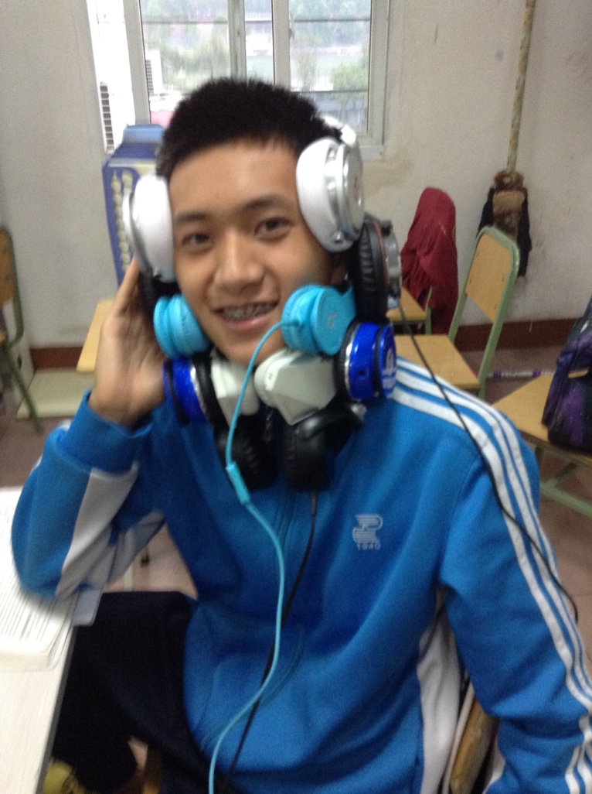
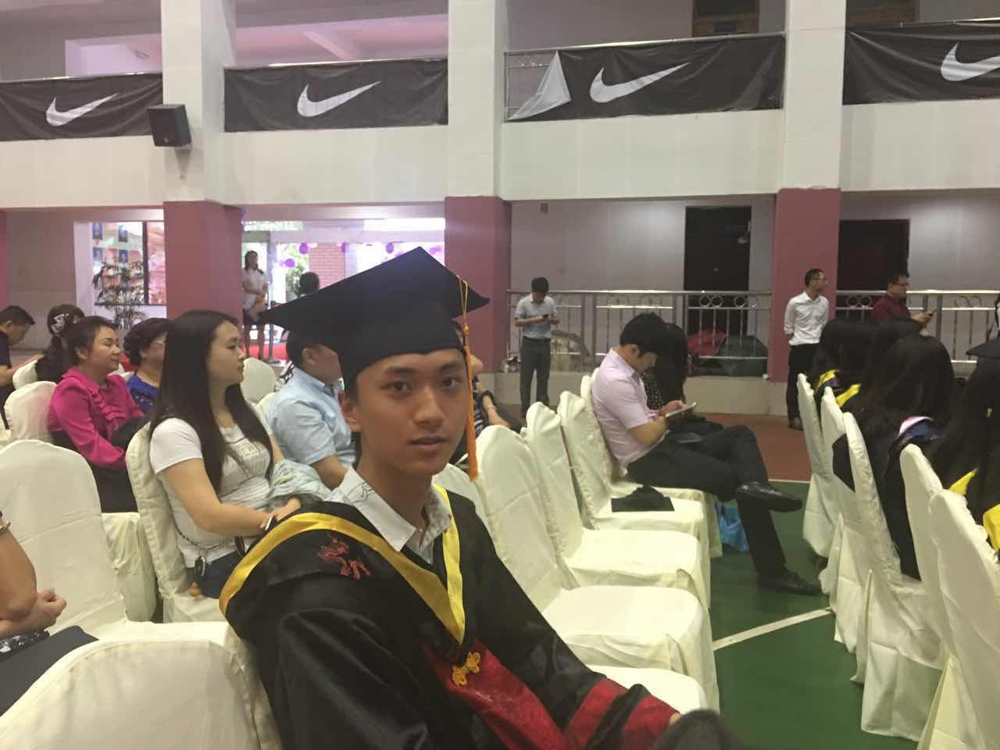

```{r setup, include=FALSE}
knitr::opts_chunk$set(echo = FALSE)
```

# Personal Statement


This is Arno, Co-Founder of CHONGQING JINGYUAN ZHIHUA TRADING CO., LTD., nice to meet you!

# My History

## High School

### Verakin High School

The predecessor of Verakin High School was Chongqing Municipal Girls' High School founded in 1940. In 1952, under the personal care of Deng Ken, Director of Chongqing Education Bureau, the site was moved from Xuantan Temple to the bank of Tushan Lake (now Nanshan Street), and it was renamed Chongqing Fourth Girls' Middle School. In 1969, it was renamed Chongqing Fourth Middle School. In 1997, it was renamed Chongqing Second Foreign Language School with the approval of the Chongqing Municipal People's Government and became a joint-stock, full-time, and fully enclosed high school. It was the only joint-stock municipal-level key high school in Chongqing until 2013. It is one of the first batch of 13 "Foreign Language Experimental Schools" awarded by the Foreign Language Education Research Center of the National Basic Education Experimental Center. It is an educational experimental base of the Southwest Basic Education Research Center.

{#id .class width=33.5% height=33.5%} {#id .class width=60% height=60%}

## Under Graduate

### Michigan State University

Michigan State University (MSU) is a public land-grant research university in East Lansing, Michigan. MSU was founded in 1855 and served as a model for land-grant colleges and universities later created under the Morrill Act of 1862. The university was founded as the Agricultural College of the State of Michigan, one of the country's first institutions of higher education to teach scientific agriculture. After the introduction of the Morrill Act, the college became coeducational and expanded its curriculum beyond agriculture. Today, MSU is one of the largest universities in the United States (in terms of enrollment) and has approximately 634,300 living alumni worldwide.

U.S. News & World Report ranks its graduate programs the best in the U.S. in elementary teacher's education, secondary teacher's education, industrial and organizational psychology, rehabilitation counseling, African history (tied), supply chain logistics and nuclear physics in 2019. MSU pioneered the studies of packaging, hospitality business, supply chain management, and communication sciences. Michigan State is a member of the Association of American Universities and is classified among "R1: Doctoral Universities – Very high research activity". The university's campus houses the National Superconducting Cyclotron Laboratory, the W. J. Beal Botanical Garden, the Abrams Planetarium, the Wharton Center for Performing Arts, the Eli and Edythe Broad Art Museum, the Facility for Rare Isotope Beams, and the country's largest residence hall system.

The Michigan State Spartans compete in the NCAA Division I Big Ten Conference. Michigan State Spartans football won the Rose Bowl Game in 1954, 1956, 1988 and 2014, and the university claims a total of six national football championships. Spartans men's basketball won the NCAA National Championship in 1979 and 2000 and has attained the Final Four eight times since the 1998–1999 season. Spartans ice hockey won NCAA national titles in 1966, 1986 and 2007. The women's cross country team was named Big Ten champions in 2019. In the fall of 2019, MSU student-athletes posted all-time highs for graduation success rates and federal graduation rates, according to NCAA statistics.


## Master

### Georgetown University

Georgetown University is a private Jesuit research university in the Georgetown neighborhood of Washington, D.C. Founded by Bishop John Carroll in 1789 as Georgetown College, the university has grown to comprise ten undergraduate and graduate schools, among which are the School of Foreign Service, School of Business, Medical School, Law School, and a campus in Qatar. On a hill above the Potomac River, the school's main campus is identifiable by its flagship Healy Hall, a National Historic Landmark.

Georgetown is the oldest Catholic institution of higher education in the United States. The Jesuits have participated in the university's academic life, both as scholars and as administrators, since 1805. However, the university has always been governed independently of the church, and the majority of Georgetown students are not Catholic.

Georgetown is ranked among the top universities in the United States and admission is highly selective. The university offers degree programs in forty-eight disciplines, enrolling an average of 7,500 undergraduate and 10,000 post-graduate students from more than 135 countries. Georgetown's notable alumni include 27 Rhodes Scholars, 32 Marshall Scholars, 33 Truman Scholars, 429 Fulbright Scholars, 2 U.S. Presidents, and 2 U.S. Supreme Court Justices, as well as international royalty and 14 foreign heads of state. Among the world's leading institutions in government and international relations, the school's alumni include more U.S. diplomats than any other university and many members of the United States Congress.

Georgetown is home to the country's largest student-run business, largest student-run credit union, oldest continuously running student theatre troupe and one of the oldest debating societies in the United States. The school's athletic teams are nicknamed the Hoyas and include a men's basketball team, which has won a record eight Big East championships, appeared in five Final Fours, and won a national championship in 1984. The university also has a co-ed sailing team that holds thirteen national championships and one world championship title.
